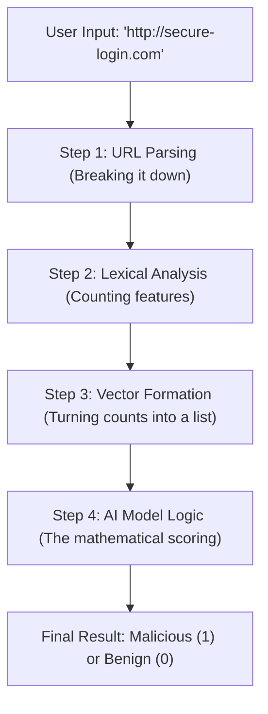

# 🕵️‍♂️ Malicious URL Detection: The Complete Internal Journey

This guide explains exactly what happens inside the system from the moment you type a URL until the AI gives its final verdict.

---

## 🚦 Phase 1: The High-Level Flowchart



---

## 🛠️ Step 1: URL Parsing (Breaking it Down)

Before we count anything, we must understand the structure. We don't just look at the string as a whole; we use a tool called `urlparse` to divide it:

*   **URL:** `http://www.google.com/search?q=ml`
*   **Protocol:** `http`
*   **Hostname:** `www.google.com`
*   **Path:** `/search`
*   **Query:** `q=ml`

---

## 🔢 Step 2 & 3: From Counting to Vectorization

We look at different "dimensions" of the URL to convert it into numbers.

### 🕵️ How we "Count" & The Differences between Features

| Feature Type | What we count | **How** we count it | **Why** it matters |
| :--- | :--- | :--- | :--- |
| **Length Features** | `url_len`, `path_len` | `len(url)` | Malicious URLs often use very long strings to hide their true destination. |
| **Delimiters** | Dots (`.`), Hyphens (`-`), At (`@`) | `url.count('.')` | Phishing sites use many dots (fake subdomains) or hyphens to mimic real brands. |
| **Character Types** | Digits (0-9), Letters (a-z) | `sum(c.isdigit())` | Random strings of numbers are a common sign of automatically generated malicious domains. |
| **Network Type** | IP Address presence | `re.search(regex)` | Legitimate sites use names. Malicious sites often use raw IPs to bypass DNS filters. |
| **Semantic Hits** | "login", "bank", "free" | List comparison | These are "Social Engineering" triggers used to trick people. |

### 📦 Vector Formation
Once we have all these counts, we pack them into a simple list:
**Vector (X):** `[36, 1, 2, 3, 1, 1, 0]`

---

## 🧠 Step 4: Internal Formula Logic (How Models Learn vs Predict)

We take the **Vector X** and pass it through the ML models.

### 🔷 1. Voting Classifier (LR + SVM + Random Forest)

⚙️ **Step 1: Logistic Regression (Prediction Phase)**
*   **Math**: $z = 6.1 \rightarrow P_1 = 0.997 \rightarrow$ **Output = 1**
*   🧠 **How it Learns**: During training, it adjusts weights using $w = w + \alpha(y - \hat{y})x$. If "login" appears in malicious URLs, its weight increases; if "https" is in safe URLs, its weight becomes negative.

⚙️ **Step 2: SVM Calculation**
*   **Math**: $f(X) = 4.98 \rightarrow$ **Output = 1**
*   🧠 **How it Learns**: It solves an optimization problem ($\min ||w||$) to find the best boundary separating classes while maximizing the "safety margin."

⚙️ **Step 3: Random Forest**
*   **Math**: Tree outputs = `[1, 1, 0, 1, 1]` $\rightarrow$ Avg = 0.8 $\rightarrow$ **Output = 1**
*   🧠 **How it Learns**: Each tree creates specialized "if-then" rules (e.g., *if "login" and length > 30 → Malicious*). It learns rules, not weights.

⚙️ **Step 4: Voting Mechanism**
*   **Final Decision**: LR(1), SVM(1), RF(1) $\rightarrow$ **Majority = 1**

---

### 🔷 2. Hybrid Model (K-Means + Random Forest)

⚙️ **Step 1: K-Means Clustering**
*   **Math**: Assigned Cluster = **2**
*   🧠 **How it Learns**: It starts with random centers and updates them ($\mu = mean$) until stable. It learns that "Cluster 1" is safe and "Cluster 2" is malicious based on the URL patterns grouped together.

⚙️ **Step 2: Analysis**
*   **New Vector (X')**: `[36, 1, 2, 3, 1, 1, 0, 2]` (The Cluster ID '2' is now an extra feature).

⚙️ **Step 3: Final Decision**
*   The Random Forest now uses this "cluster hint" to make a better final prediction. **Output = 1**.

---

### 🔷 3. Stacking Model (KNN + SVM → Random Forest) 🥇

⚙️ **Step 1: KNN**
*   **Math**: 5 Neighbors = `[1, 1, 1, 0, 1]` $\rightarrow$ $P_1 = 0.8 \rightarrow$ **Output = 1**
*   🧠 **How it Learns**: It doesn't use weights. It simply "stores" the training data. For a new URL, it calculates the distance $\sqrt{\sum(x_i - x_j)^2}$ to find similar past examples.

⚙️ **Step 2: SVM**
*   $f(X) = 4.98 \rightarrow$ **Output = 1** (Boundary learned via optimization).

⚙️ **Step 3: Meta-Model Training (The Secret Sauce)**
*   **Input (Z)**: `[1, 1]` (Predictions from KNN and SVM).
*   🧠 **How it Learns**: The Meta-Model (Random Forest) learns patterns like: *"If KNN and SVM both say 1, it's definitely a threat. If they disagree, look at the specific features again."*

⚙️ **Step 4: Final Decision**
*   **Output = 1**.

---

## 🎯 Step 5: The Final Decision

The **Malicious URL Detection Engine** calculates its final probability ($P$):

*   If **$P > 0.5$**: The **URL** is flagged as **MALICIOUS** (Dangerous) 🚨
*   If **$P < 0.5$**: The **URL** is flagged as **BENIGN** (Safe) ✅

---

### 📈 Global Performance Results

| Model | Accuracy | Logic Style |
| :--- | :--- | :--- |
| **Random Forest** | **94.27%** | Ensemble of Decision Trees |
| **KNN** | **93.40%** | Distance-based Clustering |
| **Stacking** | **93.08%** | Multi-level Meta-Learning |

### 🖼️ Confusion Matrix Graphs

````carousel

<!-- slide -->

<!-- slide -->

````

---

## 🚀 Fischer Detector Web Application

We have built a modern, full-stack web application to interact with the model in real-time.

### Features
- **Live URL Scanning**: Instant prediction with risk probability scoring.
- **Lexical Indicators**: Breakdown of 14+ lexical features extracted from the URL.
- **Premium UI**: Dark-themed glassmorphism design for a professional look.

### How to Run
1. **Start Backend**: 
   ```bash
   cd project
   ./venv/bin/python api.py
   ```
2. **Start Frontend**:
   ```bash
   cd project/web
   npm run dev
   ```
